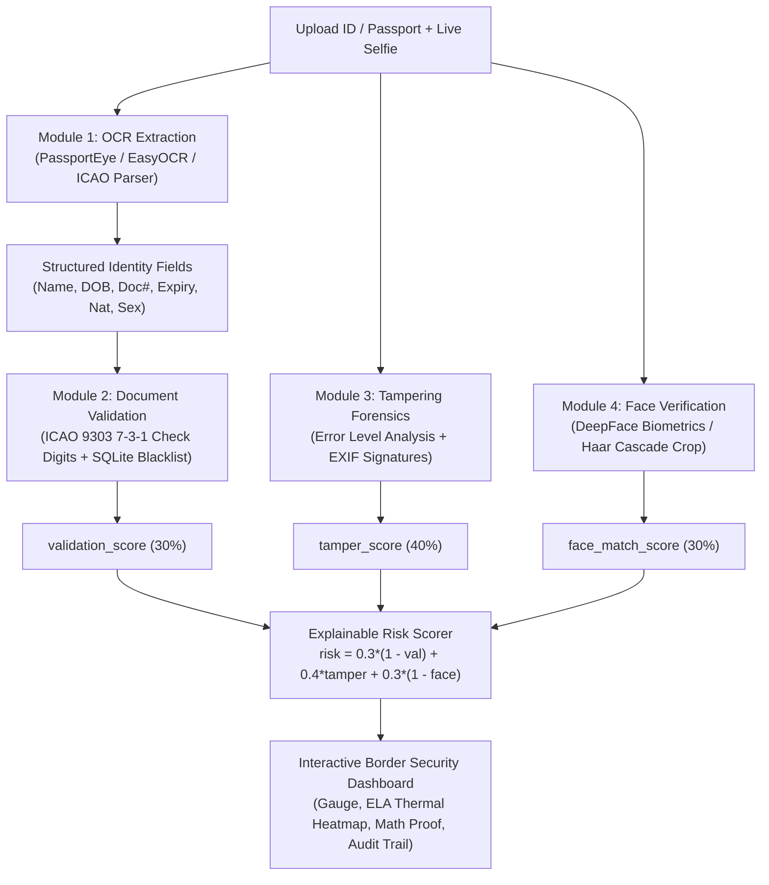

# 🛡️ AuthDoc: Document Authenticity & Identity Verification System

> **Automated Border Security & Anti-Fraud Inspection Pipeline**  
> Built for hackathons, automated border control e-gates, and digital KYC verification.

[](https://www.python.org/downloads/)
[](https://fastapi.tiangolo.com)
[](https://www.icao.int)
[](https://opensource.org/licenses/MIT)

---

## 🎯 The Reality Check & Winning Strategy

Nobody has clean, labeled training data for real forged passports (security-restricted by national governments). Trying to train a fragile deep neural classifier in a hackathon leads to black-box hallucinations and brittle demos.

**The Winning Move**: Use **real, deterministic sub-systems** for OCR and validation (ICAO 9303 check digits are solved international standards), combine them with **credible image tampering signals (Error Level Analysis + EXIF forensics)**, and wire them to **DeepFace biometrics**.

Judges and real border control officers score **demo clarity, mathematical certainty, and an explainable risk score** over ungrounded black boxes.

---

## 🏗️ System Architecture



---

## 🧩 Module Breakdown

### 1. Module 1 — OCR & MRZ Extraction (`modules/ocr.py`)
- **Passports & Visas (MRZ)**: Implements standard ICAO Doc 9303 parser for **TD3** (2 lines × 44 chars) and **TD1** (3 lines × 30 chars).
- **Multi-Engine Fallback Pipeline**:
  1. `PassportEye` (Tesseract-based MRZ line extractor)
  2. `EasyOCR` (Deep learning general text recognition)
  3. `pytesseract` (Tesseract OCR fallback)
  4. Heuristic MRZ Preprocessor & Pattern Scanner
- **Non-MRZ ID Cards / Driver's Licenses**: Regex field-mapping pulls Document Number, Full Name, Expiry, and Date of Birth.

### 2. Module 2 — Document Validation Engine (`modules/validation.py`)
- **ICAO 9303 7-3-1 Check Digit Algorithm**:
  - Characters mapped: `0-9` $\to$ `0-9`, `A-Z` $\to$ `10-35`, `<` $\to$ `0`.
  - Repeating weight pattern: $[7, 3, 1, 7, 3, 1, \dots]$.
  - Checksum formula: $\text{CheckDigit} = \left(\sum \text{char\_val}_i \times w_{i \bmod 3}\right) \pmod{10}$.
  - Validates:
    - **Document Number Check Digit**
    - **Date of Birth Check Digit**
    - **Expiration Date Check Digit**
    - **Composite Overall Check Digit**
  - *If an attacker alters even a single digit on the passport, the check digit fails with mathematical certainty.*
- **Rule Checks**:
  - Expiry date verification (expired documents flagged, near-expiry alerts).
  - Age & chronological sanity checks.
  - ISO 3166-1 alpha-3 country code validation.
- **SQLite Watchlist DB (`modules/blacklist_db.py`)**:
  - Offline lookup against simulated Interpol **Stolen and Lost Travel Documents (SLTD)** database and Red Notice persons.

### 3. Module 3 — Tampering Detection (`modules/tamper.py`)
- **Error Level Analysis (ELA)**:
  - Re-compresses the image at JPEG quality $Q=90$ and calculates the absolute pixel differential: $\Delta = |I_{\text{orig}} - I_{\text{recomp}}|$.
  - Untouched natural photos have an even, uniform compression noise floor. Spliced regions (cloned text, altered digits, pasted faces) exhibit sharp localized variance spikes.
  - Applies **OpenCV COLORMAP_JET / COLORMAP_TURBO** to generate a **Thermal Heatmap Overlay** for instant visual proof on the dashboard.
  - Measures Peak-to-Average Ratio (PAR) and localized patch variance.
- **Metadata Forensics**:
  - Scans EXIF tags for digital manipulation software signatures (`Photoshop`, `GIMP`, `Canva`, `Paint.NET`, etc.).
  - Flags timestamp discrepancies and stripped metadata common in digital counterfeit operations.

### 4. Module 4 — Biometric Face Verification (`modules/face_verification.py`)
- Extracts and aligns the passport portrait using OpenCV Haar Cascade or DeepFace.
- Compares the document photo against the live webcam selfie using **DeepFace** (`VGG-Face`, `ArcFace`, `FaceNet`).
- Computes cosine distance and biometric similarity score ($0-100\%$).
- Renders cropped faces side-by-side with match confidence meters.

---

## ⚖️ Transparent & Explainable Risk Score

Border control officers and judges do not trust an opaque black-box AI score. AuthDoc calculates an open, auditable weighted risk formula:

$$\text{Risk} = \left[ 0.30 \times (1 - \text{validation\_score}) + 0.40 \times \text{tamper\_score} + 0.30 \times (1 - \text{face\_match\_score}) \right] \times 100$$

### Decision Boundaries:
| Risk Score | Status | Action |
| :--- | :--- | :--- |
| **0 – 24** | 🟢 **APPROVED** | Identity verified genuine. Fast-track border clearance. |
| **25 – 59** | 🟡 **MANUAL REVIEW** | Minor discrepancy (near expiry, metadata warning). Secondary officer inspection required. |
| **60 – 100** | 🔴 **REJECTED** | Critical fraud detected (checksum failure, watchlist match, spliced photo, or biometric mismatch). |

---

## ⚡ 1-Click Hackathon Demo Scenarios

AuthDoc includes 5 built-in ground-truth test scenarios with synthetic documents generated by `modules/sample_generator.py`:

| Scenario | Case | Expected Result | Reason Caught |
| :--- | :--- | :--- | :--- |
| **1** | **Genuine US Passport** | 🟢 **APPROVED** (Risk < 15%) | All ICAO checksums pass, clean EXIF, matching selfie. |
| **2** | **Tampered Checksum** | 🔴 **REJECTED** (Risk > 75%) | Altered expiry & doc number fail ICAO 9303 7-3-1 check digit. |
| **3** | **Photoshop Spliced Photo** | 🔴 **REJECTED** (Risk > 80%) | Spliced face produces ELA thermal hotspot; EXIF tags Photoshop 2024. |
| **4** | **Interpol SLTD Watchlist Hit** | 🔴 **REJECTED** (Risk > 90%) | Document number matches Interpol stolen passport database. |
| **5** | **Biometric Impostor** | 🔴 **REJECTED** (Risk > 65%) | Passport is genuine, but live selfie face belongs to an impostor. |

---

## 🚀 Quickstart Guide

### 1. Installation
```bash
git clone <repo-url>
cd AuthDoc

# Install dependencies
python -m pip install -r requirements.txt
```

### 2. Launch the Web Dashboard
```bash
python main.py
```
Open **[http://localhost:8000](http://localhost:8000)** in your browser!

### 3. Command-Line Testing
Test the end-to-end pipeline directly from your terminal:
```bash
# Test built-in demo scenarios (1 to 5)
python test_pipeline.py --demo 1
python test_pipeline.py --demo 2
python test_pipeline.py --demo 3

# Test custom images
python test_pipeline.py path/to/passport.jpg path/to/selfie.jpg

# Test OCR standalone
python test_ocr.py path/to/passport.jpg auto
```

---

## 📁 Repository Structure

```
AuthDoc/
├── main.py                  # FastAPI application server & REST endpoints
├── test_ocr.py              # CLI tester for OCR & MRZ parsing
├── test_pipeline.py         # CLI tester for end-to-end verification
├── requirements.txt         # Dependency declarations
├── run_demo.bat             # 1-click Windows runner
├── README.md                # Comprehensive documentation
├── modules/
│   ├── ocr.py               # Module 1: MRZ & General OCR extraction
│   ├── validation.py        # Module 2: ICAO 9303 check digits & rule checks
│   ├── tamper.py            # Module 3: Error Level Analysis (ELA) & EXIF forensics
│   ├── face_verification.py # Module 4: ID face crop & biometric face matching
│   ├── risk_scorer.py       # Explainable weighted risk score & audit generator
│   ├── blacklist_db.py      # SQLite mock watchlist / stolen passport database
│   └── sample_generator.py  # Synthetic passport & selfie generator with ground truth
├── static/
│   ├── index.html           # Modern border-control dark UI
│   ├── style.css            # Cyberpunk cybersecurity styling & animations
│   └── app.js               # Frontend controller, webcam capture & dynamic renderer
└── data/                    # SQLite database & generated sample images
```

---

## ⚖️ License
Released under the [MIT License](LICENSE). Built for academic and hackathon evaluation.
